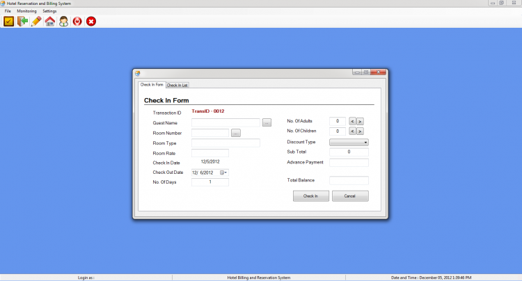

# Simple Hotel Management System Using VB.Net

### Description

The Simple Hotel Management System is a VB.NET project that can help manage the hotel's Guest Room Check-in/Check-out and Reservation. This system stores the list of Guests, Hotel Rooms, Reserved Rooms and etc.

### Features

<ul>
  <li><strong>Login Page</strong></li>
  <li><strong>Home Page/ Main Form</strong></li>
  <li><b>Hotel Rooms Management</b>
    <ul>
      <li><b>Add</b></li>
      <li><b>Edit</b></li>
      <li><b>Delete</b></li>
    </ul>
  </li>
  <li><b>Guest List Management</b>
    <ul>
    <li><b>Add</b></li>
    <li><b>Edit</b></li>
    <li><b>Delete</b></li>
    </ul>
  </li>
  <li><b>Reservation Management</b>
    <ul>
      <li><strong>New Reserve</strong></li>
      <li><strong>Check-in Reserve</strong></li>
      <li><strong>Cancel Reservation</strong></li>
    </ul>
  </li>
  <li><strong>Check-in Management</strong></li>
  <li><strong>Check-out Management</strong></li>
</ul>

Visit [www.sourcecodester.com](https://www.sourcecodester.com/visual-basic-net/4872/simple-hotel-management-system-using-vbnet.html) for more details and information about this project.

### Website Info

| Title | Simple Hotel Management System Using VB.Net with Source Code |
|:--|:--|
| Website | [www.sourcecodester.com](https://www.sourcecodester.com) |
| Link | https://www.sourcecodester.com/visual-basic-net/4872/simple-hotel-management-system-using-vbnet.html |
| Language | PHP |
| Uploader/Developer | [neiljun_rockz](https://www.sourcecodester.com/visual-basic-net/4872/simple-hotel-management-system-using-vbnet.html) |
